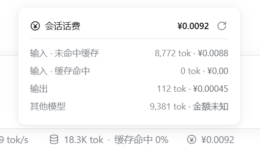

# dsh-session-cost-cny

[DeepSeek Harness](https://github.com/deepseek-ai/deepseek-harness)（DSH）插件：在会话**输入框下方的状态条**里，
实时显示**当前会话**的 DeepSeek 话费（人民币），点击金额在其正上方弹出按 输入 / 缓存 / 输出 分类的花费明细。



## 安装

```sh
dsh plugin --profile web add dsh-session-cost-cny
```


## 配置

插件行位于本包的 `cordis.patch.yml`，装进 profile 后生效；所有键可选：

```yaml
- insert:
    - id: session-cost-cny
      name: dsh-session-cost-cny
      config:
        usdCny: 6.71           # 官网英文页为美元价时的换算汇率
        refreshOnStart: false  # 默认 false：优先用本地缓存；true = 每次启动都强制重抓
        routeOverrides: []     # 按渠道覆盖单价（人民币/百万 tokens），优先级高于官网
```

`routeOverrides` 用来让某个第三方渠道走它自己的真实价格（优先级高于官网）。**所有单价的单位都是
人民币元 / 百万 tokens**，与官网中文页价目表同单位；计费公式是 `该项花费 = tokens ÷ 1_000_000 × 该项单价`，
逐条调用按它自己那一刻的峰谷取价：

| 字段 | 单位 | 含义 |
| --- | --- | --- |
| `route` | — | `"provider/model"`，与用量所属路由精确匹配（忽略大小写与空白） |
| `label` | — | 展示名，可选 |
| `miss` | 元 / 百万 tokens | 未命中缓存的**输入**价（空闲时段；同时是 `missPeak` 的缺省值） |
| `missPeak` | 同上 | 高峰时段的未命中输入价，可选；不写则与 `miss` 相同 |
| `hit` | 同上 | **缓存读取**（命中缓存）的输入价（空闲时段；`hitPeak` 同理可选） |
| `out` | 同上 | **输出**价（空闲时段；`outPeak` 同理可选） |
| `write` | 同上 | **缓存写入**价，不分时段；该渠道不收这项就写 `0` |

```yaml
        routeOverrides:
          # opencode-go 的美元价 $0.15 / $0.003 / $0.60（每百万 tokens）× 7.1 换算：
          # 0.15×7.1=1.065、0.003×7.1=0.0213、0.60×7.1=4.26
          - route: opencode-go/deepseek-flash
            label: opencode-go
            miss: 1.065        # 元/百万 tokens：未命中缓存的输入
            hit: 0.0213        # 元/百万 tokens：缓存读取
            out: 4.26          # 元/百万 tokens：输出
            write: 0           # 元/百万 tokens：缓存写入（没有就写 0）
            # 想区分峰谷就再加 missPeak / hitPeak / outPeak；不写则两个时段同价
```

想在 profile 里覆盖而**不改包内文件**时，在 `${DSH_HOME}/profiles/<profile>/cordis.patch.yml`
里用同一个 `id: session-cost-cny` 再插一行（它会整体替换该行的 config，需要把键写全）。


## License

MIT
